```{r setup, include=FALSE}
knitr::opts_chunk$set(echo = FALSE, warning = FALSE, message = FALSE, cache=TRUE)
```


## Background 

{width=58%}

*Agronomist (**UFCA**→ 2018)*

*Msc. in Genetics and plant breeding (**UENF**→2020)*

*Dsc. in Genetics and breeding (**UFV**→ 2024)*

*Postdoctoral research scholar (**UFV**→2024-2025); (**ESALQ/USP**→Current)*

<!-- ## Outline -->

<!-- -   Experimental design -->
<!-- -   Mixed models equation -->
<!-- -   Individual analyses and multienvironmental trials -->
<!-- -   Factor analysis -->
<!-- -   Selection indexes -->


# Introduction to Agricultural Experimental 

## Scientific method

{width=68%}
*<small>Source: [Indeed.com - Scientific Method Steps](https://www.indeed.com/career-advice/career-development/scientific-method-steps)</small>*

## Gregor Mendel (1822-1884)
::::: columns
::: {.column width="30%"}
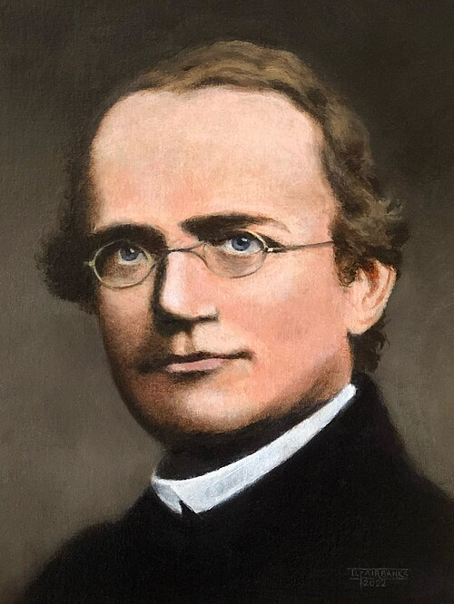{width=78%}


:::
::: {.column width="70%"}
Austrian monk carried out experiments (1854-1863)

- Segregation (genetic factors segregate during the formation of gametes)
- Independent assortment laws (Traits often segregate independently of the other)
- Dominance (Dominant and recessive alleles)

:::
:::::


## Mendel Experiments
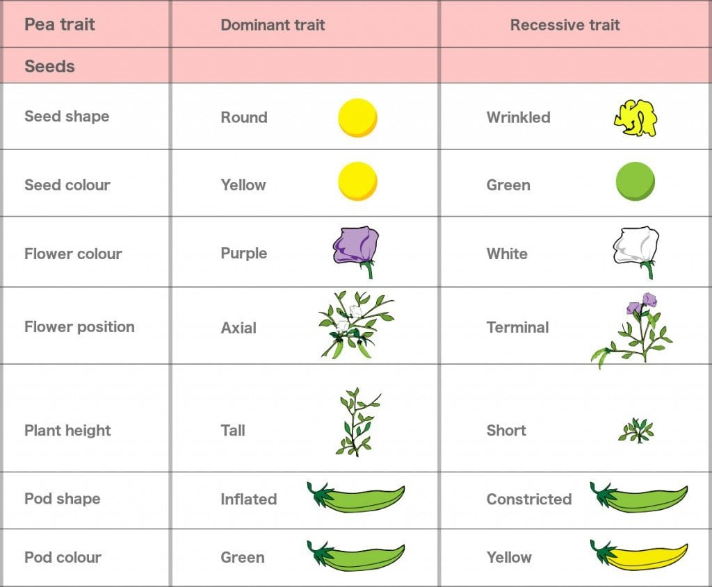{width=65%}
*<small>Source: [ScienceABC - Laws of inheritance ](https://www.scienceabc.com/humans/gregor-mendels-laws-of-inheritance-law-of-segregation-dominance-independent-assortment.html)</small>*

## Mendel Rediscovery  (1899-1900)


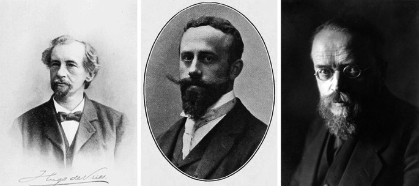{width=78%}

- Hugo de Vries (Dutch botanist)
- Erich Tschermak von Seysenegg (Austrian graduate student)
- Carl Erich Correns (German botanist)
 

## Ronald A. Fisher research

::::: columns
::: {.column width="40%"}
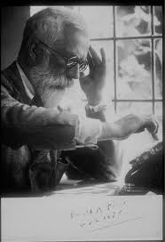{width=78%}
:::
::: {.column width="60%"}
- Extended the use of Student's t test (developed the theory of significance)
- Provided the correct interpretation of Pearson's Chi-square 
- Variance and Analysis of Variance (ANOVA) 1918
- The design of experiments (Blocking, Replication and Randomizartion - ways of increase reliability)
:::
:::::


## Battle between Biometricians and the Mendelians

::::: columns
::: {.column width="40%"}
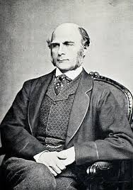{width=78%}
:::
::: {.column width="60%"}
- Galton’s book Natural Inheritance (1889) served as the inspiration for Karl Pearson, W.F.R. Weldon and William Bateson
:::
:::::


## Battle between Biometricians and the Mendelians

::::: columns
::: {.column width="40%"}
{width=48%}

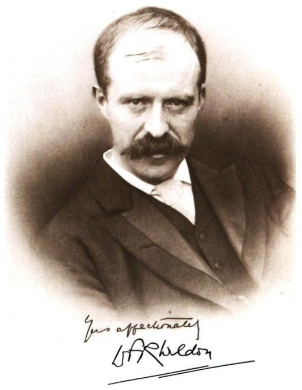{width=48%}

:::
::: {.column width="60%"}
- Pearson and Weldon were interested in **continuously varying** characters and the application of statistical techniques to their study
:::
:::::


## Battle between Biometricians and the Mendelians

::::: columns
::: {.column width="40%"}
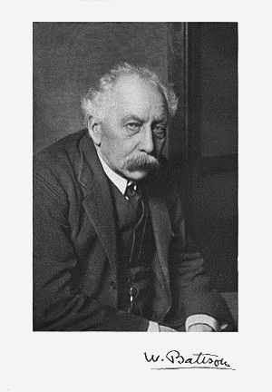{width=78%}
:::
::: {.column width="60%"}
- In contrast, Bateson had published a book on **discontinuously varying** traits so he was in a position to understand and embrace Mendel’s principles of inheritance when they were rediscovered in 1900.  [@Gillham2015]
- Mendelian theory finally won out
:::
:::::


# Quantitative genetics


## Quantitative genetics

::: {.callout-note .fragment}
### Basic model
$$
P = G + E
$$
:::

::: {.callout-note .fragment}
### Gene action
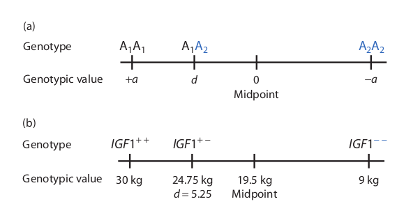{fig-align="center" width="800"}
:::


## Quantitative genetics

- How do gene frequencies affect the mean of a trait in a population?

::: {.callout-important .fragment}
### Mean Genotypic Value in a Population
| Genotypes | Freq    | Genotypic Value | Freq × Value |
|-----------|---------|-----------------|--------------|
| A₁A₁      | $p^2$   | $+a$            | $p^2a$       |
| A₁A₂      | $2pq$   | $d$             | $2pqd$       |
| A₂A₂      | $q^2$   | $-a$            | $-q^2a$      |
:::


# Experimental Design

## Main principles of experimental design

::::: columns
::: {.column width="30%"}
-   Replication
-   Randomization
:::

::: {.column width="70%"}
```{r}
#| fig-width: 10
#| fig-height: 5
library(tidyverse)
library(FielDHub)
crd1 <- CRD(
  t =5,
  reps = 3,
  plotNumber = 101,
  seed = 1987,
  locationName = "Piracicaba"
)
#crd1$infoDesign
#head(crd1$fieldBook, 3)
# cat("DIC - 5trat*3rep")
plot(crd1)


```
:::
:::::

## Main principles of experimental design

::::: columns
::: {.column width="30%"}
-   Replication
-   Randomization
- **Local control**
:::

::: {.column width="70%"}


```{r}
#| fig-width: 10
#| fig-height: 5
library(tidyverse)
library(FielDHub)

rcbd1 <- RCBD(t = 5, reps = 3,l = 1, 
              plotNumber =101, 
              continuous = TRUE,
              planter = "serpentine", 
              seed = 1020, 
              locationNames = "Piracicaba")
#rcbd1$infoDesign
#head(rcbd1$fieldBook, 3)
# cat("DBC - 5trat*3rep")
plot(rcbd1)
```
:::
:::::


## Square lattice

::::: columns
::: {.column width="40%"}
-   Many test genotypes to evaluate in RCBD
-   **k** treatments  by **k** blocks 
-    (9treat/k3/rep3)
:::
::: {.column width="60%"}
```{r,fig.width=4, fig.height=2}
#| fig-width: 8
#| fig-height: 4
squareLattice1 <- square_lattice(t =9, k =3, r = 3, l = 1, 
                                 plotNumber = 1001,
                                 locationNames = "Piracicaba", 
                                 seed = 1986)
#squareLattice1$infoDesign
#head(squareLattice1$fieldBook,12)
# cat("LÁTICE")
plot(squareLattice1)
head(squareLattice1$fieldBook)[1:3,c(3,4,5,8)]
```
:::
:::::

## Augmented randomized complete block design

::::: columns
::: {.column width="40%"}
- Trials with few seeds available 
- Large number of treatments 
- (30gen/3check/k6)
:::

::: {.column width="60%"}
```{r}
#| fig.width: 8
#| fig.height: 4
library(tidyverse)
ARCBD1 <- RCBD_augmented(lines = 30, checks = 3, b = 6, l = 1, planter = "serpentine", plotNumber = 1001, seed = 23, locationNames = "Piracicaba")
head(ARCBD1$fieldBook)[1:3,-c(1,2,3,4,11)] 
# cat("DBA") 
plot(ARCBD1)

```
:::
:::::


#  The basic principles of experimental agriculture 

## Basic principles

::: {.callout-tip}
### Repetição
Princípio que consiste em repetir mais de uma vez os tratamentos em diferentes unidades experimentais
:::

::: {.callout-tip}
### Casualização
Consiste em atribuir de forma aleatória os tratamentos às unidades experimentais
:::

::: {.callout-tip}
### Controle Local
Visa construir blocos em um experimento quando as unidades experimentais estiverem dispostas em condições ambientais heterogêneas
:::

# Anova Assumptions 

## Análise de variância

::: {.callout-tip}
### ANOVA
Ronald Fisher introduziu o termo variância e propôs a sua análise formal em 1918 na revista *theoretical population genetics* com o artigo *The Correlation Between Relatives on the Supposition of Mendelian Inheritance*.
:::

::: {.callout-tip}
### Definição
É um método para testar a igualdade de três ou mais médias populacionais baseado na análise das variâncias amostrais
:::

Os dados amostrais são separados em grupos segundo característica (fator).

## Anova Assumptions 

::: {.callout-tip appearance="minimal"}
### Aditividade
Condição imposta pelo modelo onde os diversos efeitos se somam.
:::

::: {.callout-tip appearance="minimal"}
### Normalidade dos erros
Os erros devem ser normalmente distribuídos
:::

::: {.callout-tip appearance="minimal"}
### Homogeneidade de variâncias
Assume que os erros possuem a mesma variância.
:::

::: {.callout-tip appearance="minimal"}
### Independência dos erros
A probabilidade do erro de uma observação qualquer assumir um dado valor não deve depender dos valores dos outros erros, o que define a independência deles.
:::

## ANOVA

::: {.callout-tip}
### Lógica da ANOVA
Pela lógica da ANOVA o pesquisador compara a variação acidental, ou seja, aquela devida ao acaso, com a variação devido aos tratamentos.
:::


## SQTotal
Pelo procedimento da análise de variância pode se estimar a soma de quadrados totais e decompô-la nos seus vários componentes, permitindo concluir sobre as causas ou fatores de variação.

$$
SQ_{Total}= \sum_{ij}Y_{ij}^2- C
$$

onde $\sum_{ij}Y_{ij}^2$ é o somatório de Yij ao quadrado e C é um fator de correção


## Estimação dos componentes de Variância

::: {.callout-tip}
### Quadrado médio
Os quadrados médios são obtidos dividindo-se as Soma de quadrados pelos gl das respectivas fontes de variação.
:::


## Esperança matemática
A esperança corresponde ao valor médio esperado de um quadrado médio, caso o experimento fosse repetido infinitas vezes.

$$
E(QM_T)= \sigma_e^2 + r\sigma_t^2 
$$

A razão entre QMT/QME fornece o valor de F para se quantificar o componente $\sigma_t^2$ 


# Statistical models of experimental designs

## Statistical model Delineamento Inteiramente Casualizado (DIC)

::: {.callout-tip}
### DIC
$$ Y_{ij} = \mu + t_i + e_{ij} $$
:::

$Y_{ij}$ é o valor relativo a observação $ij$

$\mu$ é a média geral do experimento

$t_i$ é o efeito do tratamento $i$

$e_{ij}$ é o erro aleatório

## Statistical model Delineamento Inteiramente Casualizado (DIC)
::: {.callout-tip}
### Hipóteses

**Hipótese Nula**
$H_0$: $\mu_1 = \mu_2 = \mu_i$

**Hipótese Alternativa**
$H_1$: $\mu_1 \neq \mu_2 \neq \mu_i$
:::


## Statistical model Delineamento em Blocos Casualizados (DBC)

::: {.callout-tip}
### DBC
$$ y_{ij}= \mu + t_i + b_j + e_{ij} $$
:::

$Y_{ij}$ é o valor relativo a observação $ij$

$\mu$ é a média geral do experimento

$t_i$ é o efeito do tratamento $i$

$b_j$ é o efeito do bloco $j$

$e_{ij}$ é o erro aleatório

## Statistical model Delineamento em Blocos Casualizados (DBC)
::: {.callout-tip}
### Hipóteses
**Hipótese Nula** $H_0$: $\mu_1 = \mu_2 = \mu_i$

**Hipótese Alternativa** $H_1$: $\mu_1 \neq \mu_2 \neq \mu_i$
:::


# Genes software

## Genes Software
[Instalação](https://youtu.be/VIWsEMkQTyE?si=ZUuiKvYkNzhGb2v-)


{fig-align="left" width="500"}


## History

::::: {layout="[ 30, 70 ]"}
<div>

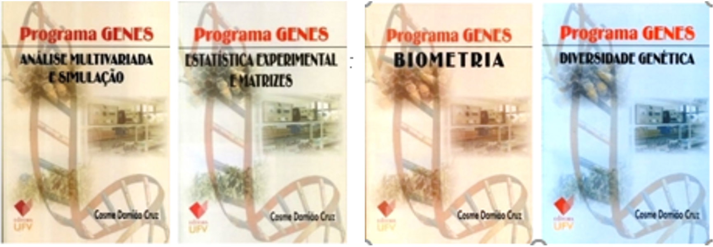{fig-align="left" width="500"}
<p style="font-size: 3.2em;">
{fig-align="left" width="200"}
</p>
</div>

::: {#sec-column}
-   1987 - Primeiras Rotinas DOS
-  1990 - Proc. biométricos <br><br> (3,1 Mbytes - 9 disquetes de 5 1/4 )
{fig-align="right" width="100"} 

-   1993 - Gqmol

-   2001 - Windows 4Mb

-   2013 - Integração com o Software R

-   2023 - Desenvolvimento de novas funções
[@Cruz2013]
:::
:::::


## Applications

```{r}
#| label: fig-genes
#| fig-cap: "Genes software architecture diagram"
#| fig-align: center
#| out.width: "80%"

# # First convert PDF to PNG (run this in R console)
# library(pdftools)
# library(ggplot2)
# 
# # Convert PDF to PNG
# pdf_convert("misc/meant/genes.pdf", format = "png", pages = 1, 
#             filenames = "misc/meant/genes.png", dpi = 300)
# 
# Then in your R Markdown/Quarto:
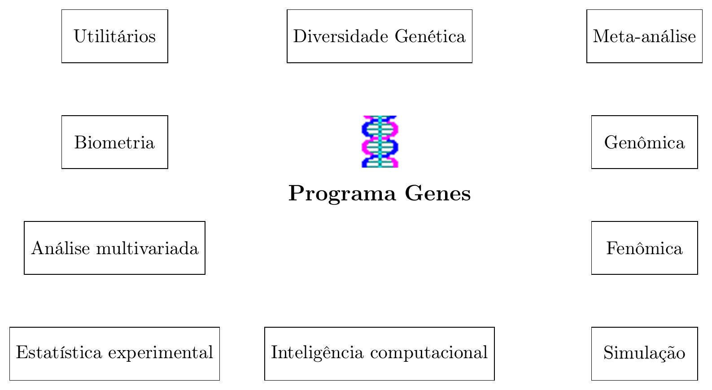
```

## Software Genes online
[Genes online](https://arquivo.ufv.br/genetica/WebSite1/Default.aspx)

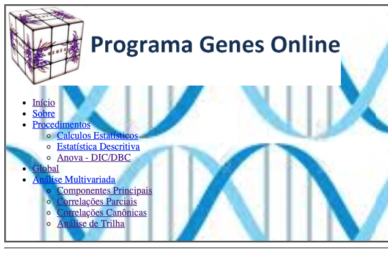{fig-align="left" width="500"} 


## Suporte para o GENES

Tutoriais e material de apoio podem ser consultado na página Genes News no facebook.

[Facebook : Genes News](https://www.facebook.com/GenesNews)

{fig-align="center" width="400"}


## Delineamento Inteiramente Casualizado

-   Experimentos conduzidos sobre condições controladas e homogêneas

-   Ex: @ramalho2012 - Absorção de água por grãos de feijão

{fig-align="center" width="400"}

## Delineamento Inteiramente Casualizado

-   10 linhagens e 3 repetições

{fig-align="center" width="400"}

## Delineamento em Blocos Casualizados

-   9 tratamentos e 2 repetições

```{r, echo=F}
library(tidyverse)
library(ggplot2)
library(dplyr)
#install.packages("dplyr")
#install.packages("ggplot2")
n_blocks <- 2
m_treatments <- 9

plot_sample_treatments <- function(n_blocks,m_treatments){
  df <- do.call("rbind",
                lapply(1:n_blocks, 
                       function(x) data.frame(
                         treatment = sample(1:m_treatments,m_treatments), 
                         block = paste0('Block ',x), 
                         sequence = (1:m_treatments))))
  df %>% ggplot(aes(x = sequence, y = block, fill = factor(treatment))) + 
    geom_tile(color = 'gray30') + 
    scale_x_discrete(expand = c(0,0))
}

plot_sample_treatments(2,9)
```

## Delineamento em Látice Simples

-   9 tratamentos e 2 repetições

```{r, echo=FALSE,results='hide',warning=FALSE,message=FALSE}
library(agricolaeplotr)
library(agricolae)
trt<- c(1:7,"BRS.MARTE","BRS.MADRE.PÉROLA")
outdesign<-design.lattice(trt,r=2,serie=3)  # simple lattice design, 10x10
```


```{r, echo=FALSE}
plot_lattice_simple(outdesign,width = 2, height = 1)
```

## Delineamento em Blocos Aumentados

-   12 tratamentos e 1 testemunha

```{r, echo=FALSE,results='hide',warning=FALSE,message=FALSE}
library(agricolaeplotr)
library(agricolae)
T1<-c('BRS.MARTE')
T2<-letters[1:12]
outdesign <-design.dau(T1,T2, r=3,serie=2)
```


```{r, echo=FALSE}
plot_dau(outdesign)
#plot_dau(outdesign,reverse_y = TRUE)
```

## Planilha de experimentos

{fig-align="center" width="400"}

-   Antes de realizar o experimeto (casualização, planejamento)

## Análise de Variância

{fig-align="center" width="400"}

-   Depois de realizar o experimento, coletar e analisar os dados.

## Teste de comparação de médias (Dunnet)

-   Teste de comparação de médias com um controle (testemunha)

-   H0: controle e o tratamento possuem médias iguais.

$$
    DMS_{Dunnet} = d \propto (k,Gl_{Resíduo}) \frac{\sqrt{2xQMR}}{r} 
$$


<!-- ## Breeding programs -->


<!-- ## Reproductive sexual -->


<!-- ## Inbreeding -->

<!-- ## Outcrossing -->


## Bibliography


