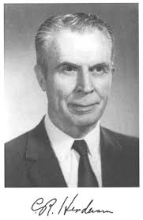
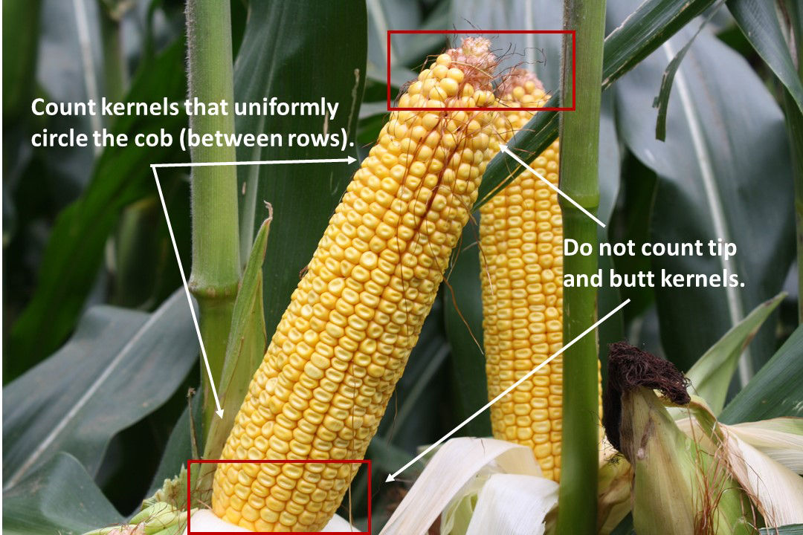
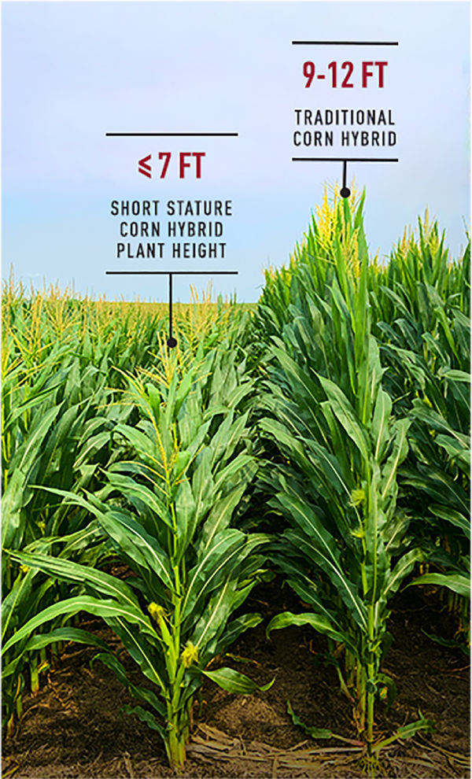
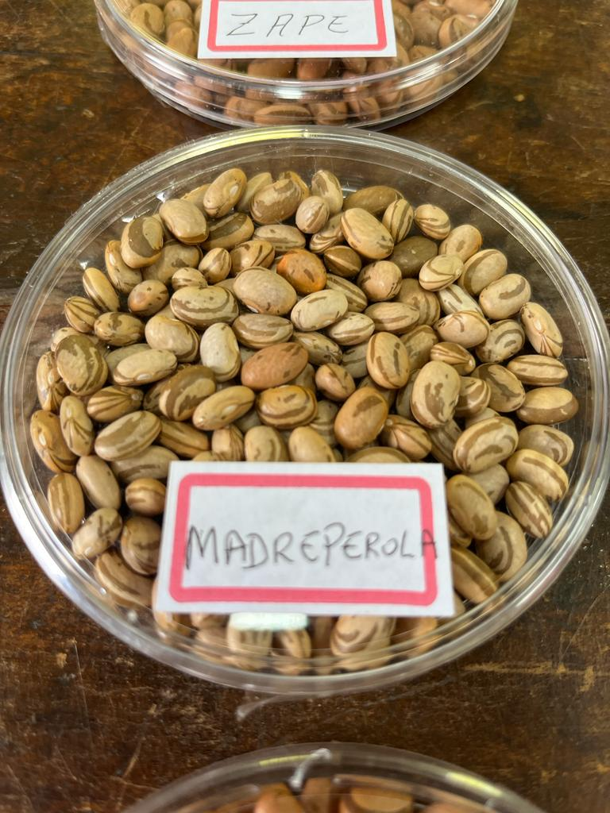
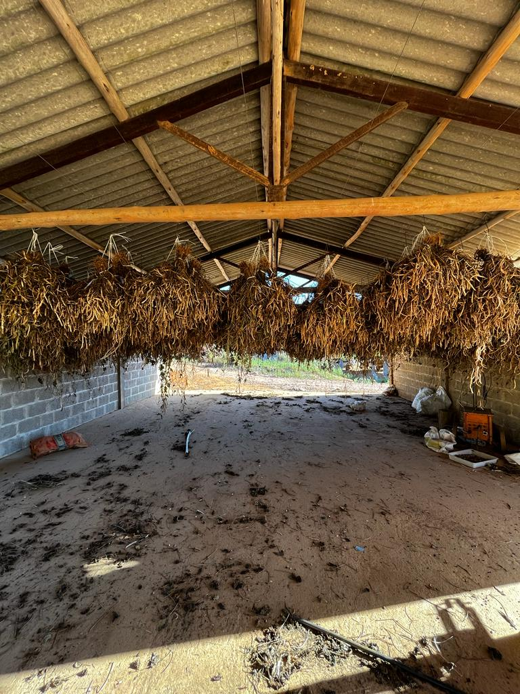

```{r setup, include=FALSE}
knitr::opts_chunk$set(echo = FALSE, warning = FALSE, message = FALSE, cache=TRUE)
```


## Background 

{width=58%}

*Agronomist (**UFCA**- 2018)*

*Msc. in Genetics and plant breeding (**UENF**-2020)*

*Dsc. in Genetics and breeding (**UFV**- 2024)*

*Postdoctoral research scholar (**UFV**-2024-2025); (**ESALQ/USP**-2025)*

<!-- ## Outline -->

<!-- -   Experimental design -->
<!-- -   Mixed models equation -->
<!-- -   Individual analyses and multienvironmental trials -->
<!-- -   Factor analysis -->
<!-- -   Selection indexes -->

# Experimental Design

## Main principles of experimental design

::: {layout-ncol="2"}
-   Replication
-   Randomization
-   Local control

```{r}
#| fig-width: 4
#| fig-height: 2
library(tidyverse)
library(FielDHub)
crd1 <- CRD(
  t =5,
  reps = 3,
  plotNumber = 101,
  seed = 1987,
  locationName = "Piracicaba"
)
#crd1$infoDesign
#head(crd1$fieldBook, 3)
# cat("DIC - 5trat*3rep")
plot(crd1)

rcbd1 <- RCBD(t = 5, reps = 3,l = 1, 
              plotNumber =101, 
              continuous = TRUE,
              planter = "serpentine", 
              seed = 1020, 
              locationNames = "Piracicaba")
#rcbd1$infoDesign
#head(rcbd1$fieldBook, 3)
# cat("DBC - 5trat*3rep")
plot(rcbd1)
```
:::

## Square lattice

::::: columns
::: {.column width="25%"}
-   Many test genotypes to evaluate in RCBD
-   **k** treatments  by **k** blocks 
-    (9treat/k3/rep3)
:::
::: {.column width="75%"}
```{r,fig.width=4, fig.height=2}

squareLattice1 <- square_lattice(t =9, k =3, r = 3, l = 1, 
                                 plotNumber = 1001,
                                 locationNames = "Piracicaba", 
                                 seed = 1986)
#squareLattice1$infoDesign
#head(squareLattice1$fieldBook,12)
# cat("LÁTICE")
plot(squareLattice1)
head(squareLattice1$fieldBook)[1:3,]
```
:::
:::::

## Augmented randomized complete block design

::::: columns
::: {.column width="30%"}
- Trials with few seeds available 
- Large number of treatments 
- (30gen/3check/k6)
:::

::: {.column width="70%"}
```{r}
#| fig.width: 4
#| fig.height: 2
library(tidyverse)
ARCBD1 <- RCBD_augmented(lines = 30, checks = 3, b = 6, l = 1, planter = "serpentine", plotNumber = 1001, seed = 23, locationNames = "Piracicaba")
head(ARCBD1$fieldBook)[1:3,-c(2,4,11)] 
# cat("DBA") 
plot(ARCBD1)

```
:::
:::::

# Mixed models equation 

## Mixed models equation

::::: columns
::: {.column width="65%"}

@henderson1953estimation (animal breeder) propose the mixed models equations.

Enables Best linear unbiased prediction (BLUP) and Best Linear Unbiased Estimator (BLUE).
:::
::: {.column width="35%"}
{width=58%}
:::
:::::

## Mixed models equation


$$
\textbf{y} = \mathbf{X}\beta + \mathbf{Z}u+ \mathbf{e}
$$


$$ 
\begin{bmatrix}
 \mathbf{X}'\mathbf{X} & \mathbf{X}'\mathbf{Z} \\
 \mathbf{Z}'\mathbf{X} & \mathbf{Z}'\mathbf{Z} + \lambda \mathbf{K}^{-1}
\end{bmatrix}
\begin{bmatrix}
 \mathbf{\hat{b}} \\
 \mathbf{\hat{u}}
\end{bmatrix}
=
\begin{bmatrix}
 \mathbf{X}'\mathbf{y} \\
 \mathbf{Z}'\mathbf{y}
\end{bmatrix}
$$


### Restricted maximum likelihood - (REML)

@Patterson1971 Restricted Maximum Likelihood (REML) of random $u$ and fixed effects $\beta$.


## Maximum likelihood function


$$
f(x)= \frac{1}{\sigma \sqrt{2\pi}}e^{-\frac{1}{2}(\frac{x-\mu}{\sigma})^2}
$$


The maximum likelihood function seeks to optimize the values of the mean $\mu$ and variance $\sigma$, given the observations and considering normal distribution.

## Mixed models equation

Neste exemplo consideramos 100 valores aleatórios gerados de uma distribuição normal com média 10 ($\mu$) e desvio padrão $\sqrt{10}$ ($\sigma$)

```{r,fig.height=2.5,fig.width=5}
set.seed(2024) #fixando o valor da "semente aleatória"set.seed(2024) #fixando o valor da "semente aleatória"
y=rnorm(100,10,sqrt(10)) #gerando as 100 obs amostrais com media=10 e desvio padrão= sqrt(10)
# cat("head de valores amostrados")
# head(y) #visualizando a amostra


plot(density(y),main = "Normal density")#plotar

```

##  Maximum likelihood function
```{r}
#| fig.height: 3.5
#| fig.width: 6
#| fig-align: "center"
#| out.width: 60%

n=100 #tamanho da amostra
mu=seq(5,15,0.1) #possíveis valores de média (eixo x)
sig2=seq(5,15,0.1) #possíveis valores de variância (eixo y)
soma_y=sum(y) #somatório Syi
soma_y2=sum(y^2) #somatório Syi2
f <- function(mu,sig2)
{((2*pi*sig2)^(-n/2))*exp((-1/(2*sig2))*(soma_y2-2*mu*soma_y+n*mu^2))}
like <- outer(mu, sig2, f)# função de verossimilhança
persp(mu, sig2, like, theta = 30, phi = 30, expand = 0.6,border = NA,
col = "lightblue", ltheta = 120, shade = 0.25, ticktype = "detailed",
xlim=c(5,15),ylim=c(5,15),xlab = "mu", ylab = "sig2", zlab = "Likelihood",cex.axis = 0.5,cex.lab = 0.5)


```


<!-- ## Mixed models equation -->


<!-- Best linear unbiased prediction (BLUP) - random -->
<!-- and Best Linear Unbiased Estimator (BLUE) - fixed -->
<!-- @Henderson1975 -->
# Single and Multienvironment trials

## Simulating phenotypic traits


::: columns

::: {.column width="55%"}
```{r gy-fig, fig.cap="Grain yield (kg ha⁻¹) of maize hybrids in simulated trials", fig.width=6, fig.height=4, out.width="88%"}


```
:::
::: {.column width="45%"}
```{r,r gy-fig, fig.cap="Plant Height (cm) of maize hybrids in simulated trials", fig.width=6, fig.height=4, out.width="48%"}

```
:::
:::

## Simulating phenotypic traits

**2 traits; 100 genotypes; 2 blocks**
```{r}
#| fig.height: 3
#| fig.width: 6
#| layout-ncol: 2
# simulação de ensaio multiambientes com múltiplas características
library(FieldSimR)

ntraits <- 2 # Number of traits
nenvs <- 3 # Number of environments
nblocks <- c(2, 2, 3) # Number of blocks per environment
block_dir <- "col" # Arrangement of blocks ("side-by-side")
ncols <- c(10, 10, 15) # Number of columns per environment
nrows <- 20 # Number of rows per environment
plot_length <- 8 # Plot length; here in meters (column direction)
plot_width <- 2 # Plot width; here in meters (row direction)

 #H2 = 0.3 for grain yield and H2 = 0.5 for plant height 
 
H2 <- c(0.3, 0.3, 0.3, 0.5, 0.5, 0.5) # c(Yld:E1, Yld:E2, Yld:E3, Pht:E1, Pht:E2, Pht:E3)
var <- c(0.086, 0.12, 0.06, 15.1, 8.5, 11.7) # c(Yld:E1, Yld:E2, Yld:E3, Pht:E1, Pht:E2, Pht:E3)
#set.seed(2024)

# Calculation of error variances based on the genetic variance and target heritability vectors.
calc_varR <- function(var, H2) {
  varR <- (var / H2) - var
  return(varR)
}

varR <- calc_varR(var, H2)
# cat("Variâncias residuais Trait per environment -
#     c(Yld:E1, Yld:E2, Yld:E3, Pht:E1, Pht:E2, Pht:E3")
# round(varR, 2) # Vector of error variances: c(Yld:E1, Yld:E2, Yld:E3, Pht:E1, Pht:E2, Pht:E3)


spatial_model <- "Bivariate" # Spatial error model.
prop_spatial <- 0.4 # Proportion of spatial trend.

ScorR <- rand_cor_mat(ntraits, min.cor = 0, max.cor = 0.5, pos.def = TRUE)
# cat("Correlação dos erros devido tendências espaciais")
# round(ScorR, 2)
# extraneous variation
ext_ord <- "zig-zag"
ext_dir <- "row"
prop_ext <- 0.2

EcorR <- rand_cor_mat(ntraits, min.cor = 0, max.cor = 0.5, pos.def = TRUE)
# cat("Correlação dos erros devido causas não conhecidas
#     (Caminhamento,máquinas e implementos)")
# round(EcorR, 2)
gv_df <- gv_df_unstr

error_ls <- field_trial_error(
  ntraits = ntraits,
  nenvs = nenvs,
  nblocks = nblocks,
  block.dir = block_dir,
  ncols = ncols,
  nrows = nrows,
  plot.length = plot_length,
  plot.width = plot_width,
  varR = varR,
  ScorR = ScorR,
  EcorR = EcorR,
  RcorR = NULL,
  spatial.model = spatial_model,
  prop.spatial = prop_spatial,
  ext.ord = ext_ord,
  ext.dir = ext_dir,
  prop.ext = prop_ext,
  return.effects = TRUE
)
pheno_ls <- make_phenotypes(
  gv_df,
  error_ls$error.df,
  randomise = TRUE, return.effects = TRUE)

pheno_df <- pheno_ls$pheno.df
pheno_env1 <- droplevels(pheno_df[pheno_df$env == 1, ])
colnames(pheno_env1) <- c("env","block","col","row","id","rep", "GY","PH")

# cat("Banco de dados simulado de Milho")
# str(pheno_env1)

plot(density(pheno_env1$GY),main="");plot(density(pheno_env1$PH),main="")

pheno_df$gv.Trait1 <- pheno_ls$Trait1$gv.Trait1
pheno_df$gv.Trait2 <- pheno_ls$Trait2$gv.Trait2

y=pheno_env1$GY
```


## Solving mixed models equation

$$ 
\begin{bmatrix}
 \mathbf{X}'\mathbf{X} & \mathbf{X}'\mathbf{Z} \\
 \mathbf{Z}'\mathbf{X} & \mathbf{Z}'\mathbf{Z} + \lambda \mathbf{K}^{-1}
\end{bmatrix}
\begin{bmatrix}
 \mathbf{\hat{b}} \\
 \mathbf{\hat{u}}
\end{bmatrix}
=
\begin{bmatrix}
 \mathbf{X}'\mathbf{y} \\
 \mathbf{Z}'\mathbf{y}
\end{bmatrix}
$$

```{r}
#| label: tbl-mixed-models
#| tbl-cap: "mixed models matrices"
#| layout-ncol: 4
#| tbl-subcap:
#|   - "X"
#|   - "Z"
#|   - "y"
#|   - "lambda"
#| tbl-cap-location: top

X= model.matrix(~block-1,data = pheno_env1)
# cat("X matrix - Efeitos fixos")
kable(head(X,n=3),caption = "X")
#X=matrix(c(1, 1, 0, 0, 0, 0, 0, 0, 0, 0, 0, 1, 1, 1, 0, 0, 0, 0, 0, 0, 0, 0, 0, 1, 1, 1, 1), 9,byrow=F) #X incidence matrix

Z=model.matrix(~id-1,data = pheno_env1)
# cat("Z matrix - Efeitos aleatórios")
kable(head(Z[,1:3],n=3),caption = "Z")
# cat("Phenotypic data")
y.df=data.frame(pheno=head(pheno_env1[,"GY"],n=1))
kable(head(y.df),caption = "y")
#Z=matrix(c(1, 0, 0, 0, 0, 0, 0, 0, 0, 0, 0, 1, 0, 0, 0, 0, 0, 0, 0, 0, 0, 0, 0, 1, 1, 0, 0, 0, 1, 0, 1, 1, 0, 0, 1, 1), 9,byrow=F) #Z incidence matrix
# cat("Error variance")
se = 0.2075                    #error variance 

# cat("Error;Genotypic variance")
su = 0.0948                   #Genotypic variance 
erro_geno=data.frame(geno=su,erro=se)
kable(head(erro_geno),caption = "lambda")
```


## Solving mixed models equation

```{r}
#| label: tbl-algebra
#| tbl-cap: "algebra with mixed models matrices"
#| tbl-subcap:
#|   - "XpX"
#|   - "XpZ"
#|   - "ZpX"
#|   - "ZpZ"
#|   - "Xpy"
#|   - "Zpy"
#| tbl-cap-location: top
#| layout-ncol: 3


X= model.matrix(~block-1,data = pheno_env1)
# cat("X matrix - Efeitos fixos")
# head(X)
#X=matrix(c(1, 1, 0, 0, 0, 0, 0, 0, 0, 0, 0, 1, 1, 1, 0, 0, 0, 0, 0, 0, 0, 0, 0, 1, 1, 1, 1), 9,byrow=F) #X incidence matrix

Z=model.matrix(~id-1,data = pheno_env1)
# cat("Z matrix - Efeitos aleatórios")
# Z[1:10,1:10]
# cat("Phenotypic data")
# pheno_env1[1:10,]
#Z=matrix(c(1, 0, 0, 0, 0, 0, 0, 0, 0, 0, 0, 1, 0, 0, 0, 0, 0, 0, 0, 0, 0, 0, 0, 1, 1, 0, 0, 0, 1, 0, 1, 1, 0, 0, 1, 1), 9,byrow=F) #Z incidence matrix
# cat("Error variance")
se = 0.2075                    #error variance 
# se
# cat("Genotypic variance")
su = 0.0948                   #Genotypic variance 
# su

# cat("Lambda")
lambda = se/su   #lambda
# lambda


# cat("XpX")
XpX = crossprod(X)  #X' X
kable(head(XpX),caption = "XpX")
# cat("XpZ")
XpZ = crossprod(X, Z) #X' Z
kable(head(XpZ)[1:2,1:2],caption = "XpZ")
# cat("ZpX")
ZpX = crossprod(Z,X) #Z' X
kable(head(ZpX)[1:2,1:2],caption = "ZpX")
# cat("ZpZ")
ZpZ = crossprod(Z)  #Z' Z
kable(head(ZpZ)[1:2,1:2],caption = "ZpZ")
# cat("Xpy")
Xpy = crossprod(X, y) #X` y
kable(head(Xpy),caption = "Xpy")
# cat("Zpy")
Zpy = crossprod(Z, y) #Z` y
kable(head(Zpy)[1:2],caption = "Zpy")
# cat("LHS")
```


## Solving mixed models equation

::: {layout-ncol="2"}
```{r}
#| label: tbl-lhs
#| tbl-cap: "LHS matrice"

LHS = rbind(cbind(XpX, XpZ), cbind(ZpX, ZpZ + diag(100)* lambda)) #LHS
head(LHS)[1:3,1:3]
```


```{r}
#| label: tbl-rhs
#| tbl-cap: "RHS matrice"
RHS = rbind(Xpy,Zpy) #RHS
# cat("RHS")
head(RHS,n=4)
```


```{r}
#| label: tbl-sol
#| tbl-cap: "sol matrice"
sol = solve(LHS) %*% RHS  #Solutions
# cat("Solutions solve(LHS) %*% RHS")
head(sol,n=4)

```
:::

## Solving mixed models equation (LME4)
::: {layout-ncol="2"}
```{r}
#| label: tbl-rhs-lme4
#| tbl-cap: "RHS and LME4 solving"

cat("Solving mixed models with package LME4")
library(lme4)
mmi=lme4::lmer(GY ~ rep + 
     (1 | id), data=pheno_env1)
# summary(mmi)
library(kableExtra)
head(sol[-c(1:2)]) |> kableExtra::kable(caption = "RHS") |>  kable_styling(full_width = FALSE, font_size = 10)
head(sol)[1:2]
```


```{r}
#| label: tbl-lme4
#| tbl-cap: "LME4 matrices"
unlist(ranef(mmi))[1:6] |> kableExtra::kable(caption = "LME4") |>  kable_styling(full_width = FALSE, font_size = 10)
fixef(mmi)
#fixef(mmi) # efeitos fixos
#cor(sol[-c(1:2)],unlist(ranef(mm)))

```
:::

## Multienvironmental trials

```{r}
#| fig.height: 2
#| fig.width: 3
#| fig-align: "center"
#| out.width: 30%
#| label: tbl-multenv
#| tbl-cap: "GY and PH evaluated in multenvironmental trials "
#colnames(pheno_df)=c("env","block","col","row","id","rep","GY","PH")
colnames(pheno_df)=c("env","block","col","row","id","rep","y.GY","y.PH","GY","PH")
data_long <- pheno_df |>  pivot_longer(cols = c("GY","PH"))

 
p2=data_long |> ggplot( aes(x=rep, y=value, color=env)) +
geom_boxplot() +
 geom_point(, alpha = 0.2, position = "jitter", size = 1) + facet_grid(name ~ env,  scales = "free") + theme_bw()
 
 
 
plot(p2)
```

$$
\mathbf{y} = \mathbf{X}_1\mathbf{e} + \mathbf{X}_2\mathbf{be} + \mathbf{Z}_1\mathbf{g} + \mathbf{Z}_2\mathbf{ge} + \mathbf{\epsilon} 
$$


$[\mathbf{g}\sim N(0,\sigma_g^2\mathbf{I}_n)]$ and
$[\mathbf{ge}\sim N(0,\sigma_{ge}^2\mathbf{I}_{np})]$,
where $n$ is the number of genotypes and $p$ is the number of environments.


## Multienvironmental trials
**2 traits; 100 genotypes; 2-3 blocks; 3 environments**


Testing genotype and genotype $\times$ environment interaction effects along traits.

$$
LRT = -2(LogL_-LogL_{r})
$$

where $LogL$ é o ponto de máxima da função de verossimilhança residual do modelo completo e $LogL_{r}$ é o mesmo para o modelo reduzido.


## Multienvironmental trials
```{r}
library(tidyverse)
library(lme4)
colnames(pheno_df)=c("env","block","col","row","id","rep","y.GY","y.PH","GY","PH")
#str(pheno_df)

mmc=lme4::lmer(y.GY ~ env+ rep:env + (1| id)+ (1| id:env), data=pheno_df)

# cat("Análise de variância conjunta - GY")
# summary(mmc)
mmcr=lme4::lmer(y.GY ~ env+ rep:env + (1| id), data=pheno_df)

# cat("LRT GxE effect - Trait GY")

2*c(logLik(mmc, REML=TRUE) - logLik(mmcr, REML=TRUE)) 
anova(mmcr,mmc)
```

## Multienvironmental trials
::: {layout-ncol="2"}
```{r}
head(do.call(rbind,ranef(mmc,whichel=("id:env")))) |> kableExtra::kable(caption = "LME4 - g x e") |>kable_styling(full_width = FALSE, font_size = 10)
```


```{r}

head(do.call(rbind,ranef(mmc,whichel=("id")))) |> kableExtra::kable(caption = "LME4 - g") |> 
   kable_styling(full_width = FALSE, font_size = 10)
```
:::

## Multienvironmental trials
```{r}
#| fig.height: 5
#| fig.width: 6
#| layout-ncol: 2
library(lattice)
rr1 <- ranef(mmc)


p1=dotplot(rr1)
plot(p1$`id:env`)
plot(p1$id)

```

# Selection indexes


## Selection indexes


### Indexes

Several indexes were proposed with and without restrictions (@Smith1936 & @Hazel1943 ; @Kempthorne1959).
We take a deep look in Factor analysis and ideotype design index (FAI-BLUP)[ @rocha2018multitrait] and Bayesian probabilistic selection index (BPSI)[@Chagas2025].

## Indexes
### Smith e Hazel
 
$$
\hat{\underline{b}} = \hat{P}^{-1} \hat{G} \hat{a};\;
$$
where $\hat{P}$ and $\hat{G}$ are phenotypic and genotypic variance-covariance matrix, respectively, and $\hat{a}$ are relative economic values.  

### Desire

$$
\underline{b} = G^{-1} \underline{q}
$$
where $G$ is the genotypic variance-covariance matrix and $q$ is the vector of desired gains [@Peek1969] 


## Desire and SH
```{r}
#| label: tbl-ds-sh
#| tbl-cap: "smith-hazel and desire indexes"
#| tbl-subcap:
#|   - "ebvMat"
#|   - "Var_Covar_ebv"
#|   - "economic weights"
#| tbl-cap-location: top
#| layout-ncol: 3

gainDiff <- function(ebvMat, b_ebv, dGain, nSel){ 
  
  # Find best individuals using index weights
  take = order(ebvMat %*% b_ebv, 
               decreasing = TRUE)[1:nSel]
  
  # Measure standardized response to selection
  mu_Sel = colMeans(ebvMat[take,])  # selected individuals
  resp = mu_Sel - colMeans(ebvMat)  # whole population
  resp = resp / sqrt(sum(resp^2)) # unity vector
  
  # Return distance between desired and expected vectors
  return(sum((resp - dGain)^2))
}

################################################################################
pheno=pheno_df  |> group_by(env) |> distinct(id,GY,PH)
blups <-pheno|> 
  pivot_wider(names_from = c("env"),values_from = c("PH", "GY"),id_cols = "id") |> 
  column_to_rownames("id") |> as.matrix()


#################################################################
### Objects that are required to find weights using real data ###
#################################################################

# IF YOUR WANT TO USE REAL DATA INSTEAD, YOU ONLY NEED TO PROVIDE:
# 1. A Genotype x EBV matrix (dim = inds x traits)
# 2. A vectors of desired gains.
# head(blups)

# rownames(blups)=NULL
# gmod = BLUP.df  |> filter(!userID %in% checks) |>   column_to_rownames(var = "userID") |> 
#   select(-5) |>  as.matrix()
# head(gmod)
#######
### 1. Matrix of EBVs and the covariance matrix between EBVs

# "blups" were generated using simEbv.R - to be replaced with real data!
ebvMat <- blups

kable(head(round(ebvMat,2))[1:2,1:2], caption = "genotypic matrix")
# Covariance between EBVs 
# -> use population variance, not sample variance (since the EBVs for the whole 
#    population to select from are known. It is not just sample used to derive a
#    var-covar matrix for a bigger unknown population.)

# popVar() is a function in AlphaSimR to calculate the population variance (and
# not the sample variance as function var() does).
G_ebv=var(blups, na.rm = T)


G_ebv <- AlphaSimR::popVar(ebvMat)  
# G_ebv
#######
### 2. Set desired gains and scale desired gains vector to unity vector

# Desired gains can be defined in absolute desired gains, relative desired gains 
# or standardised desired gains. It is only important that the unit of the desired 
# gains vector matches the unit of the data, i.e.:
# - if we use the true units of the EBVs, desired gains have to be (scaled) true units
# - if the EBVs are standardized using the standard deviation, desired gains
#   have to be provided in standard deviation format.

# NOTE: Important to drive gain in the desired direction for all traits is 
# the improvement ratio between desired gains, not the absolute value. This means:
# the desired gains vectors (2, 4, 5), (4, 8, 10), and (1, 2, 2.5) will all have 
# the same effect.

kable(round(head(G_ebv)[1:4,1:4],2), caption = "variance covariance matrix")
# desiredGain = c(-1,-1,2) # to be replaced by your actual desired gains!
desiredGain = c(-1,-1,-1,2,2,2)      
kable(head(desiredGain), caption = "economic weights")               
# To be used with the optimization function, our desired gain vector has to be 
# scaled to a unity vector (the ratio between desired gains remains the same)
desiredGain = desiredGain/sqrt(sum(desiredGain^2))

# The unity vector has the following property
# sum(desiredGain^2) # = 1
```


## Desire and SH

```{r}
#| label: tbl-ds-sh-results
#| tbl-cap: "results smith-hazel and desire"
#| tbl-subcap:
#|   - "economic weights"
#|   - "optimum weights"
#| tbl-cap-location: top
#| layout-ncol: 2

#######
### 3. "Traditional" way to calculate weights to achieve desired gains

# Weights based on desired gains and the covariance between traits using EBVs 
b_ebv <- solve(G_ebv) %*% desiredGain
kable(head(b_ebv),caption = "G-1 * a") # index weights

# We also use b_ebv as starting point for the optimization process!


#######
### 4. Optimal index weights

# Unlike the "traditional" method, the optimization method requires that the 
# number of individuals to be selected is provided. The weights are going to be
# optimized for those individuals then.

nSel <- 25 # Select top 60 individuals to maximize gain at the desired ratio

# We assume that the trait improvement ratio achieved in the top selected individuals
# is representative of their progeny (when crossed at random). This might not be
# the case in reality, but the optimized weights should enable a good approximation
# (better than the "traditional" approach)


# Function finds weights to minimize the difference between the expected and 
# desired gain trait ratio for the top nSel individuals.
opt_weights <- optim(par = b_ebv, fn = gainDiff, ebvMat = ebvMat, dGain = desiredGain, nSel = nSel) 

opt_weights <- opt_weights$par
kable(opt_weights, caption = "optimum weights")


#######
### 5. Calculate index values and select top individuals

ebvIndex <- ebvMat %*% opt_weights
ebvIndex <- ebvIndex[order(ebvIndex, decreasing = TRUE), ]


### The top nSel individuals in ebvIndex are those to be selected! ###

# NOTE: if the number of selected individuals is to be changed, the optimization
# has to be run again. The optimized weights refer to the defined number of 
# individuals only.

selected <- rownames(ebvMat) %in% names(ebvIndex[1:13]) 
selected <- ebvMat[selected, ]

# all individuals ranked here
rankdesire <- rownames(ebvMat) %in% names(ebvIndex) 
rankdesire <- ebvMat[rankdesire,]

# Comparison of optimized expected gains and desired gain
expRespOpt <- colMeans(selected) - colMeans(ebvMat)   
scaleExpRespOpt <- expRespOpt / sqrt(sum(expRespOpt^2))
```

## Desire and SH
```{r}
#| label: tbl-ds-sh-gain
#| tbl-cap: "weights smith-hazel and desire"
#| tbl-subcap:
#|   - "gain SH"
#|   - "SH"
#|   - "gain DS"
#|   - "DS"
#| tbl-cap-location: top
#| layout-ncol: 4

#######
### 6. Compare optimized weights to gains achieved using the "traditional" weights

# This is just to demonstrate how the traditional weights are outperformed 
# by the optimized weights.

ebvIndex2 <- ebvMat %*% b_ebv
ebvIndex2 <- ebvIndex2[order(ebvIndex2, decreasing = TRUE), ]

selected2 <- rownames(ebvMat) %in% names(ebvIndex2[1:13]) 
selected2 <- ebvMat[selected2, ]

# Comparison of optimized expected gains and desired gain
expResp <- colMeans(selected2) - colMeans(ebvMat)   
scaleExpResp <- expResp / sqrt(sum(expResp^2))


kable(scaleExpResp,caption = "gain smith hazel")

kable(sum((desiredGain - scaleExpResp)^2),caption = "sum gain SH")


kable(scaleExpRespOpt,caption = "gain Desire")


# Measure squared differences for responses (smaller is better)

kable(sum((desiredGain - scaleExpRespOpt)^2), caption = "sum gain DS")


```


## Factor analysis

Maize simulated dataset (2 traits \* 3 enviroments)

To proceed factor analysis, we should do the pearson correlation between traits and create matrix correlation.
 
```{r}
#| layout-ncol: 2
mmcp=lme4::lmer(PH ~ env+ rep:env + (1| id)+ (1| id:env), data=pheno_df)
PH.df=do.call(rbind,ranef(mmc,whichel=("id:env")))
PH.df=do.call(rbind,ranef(mmcp,whichel=("id:env")))
GY.df=do.call(rbind,ranef(mmc,whichel=("id:env")))
PH.df <- PH.df |> rownames_to_column("effect") |> 
  mutate(env=sub(".*:","",effect)) |> mutate(geno=str_extract(string = rownames(PH.df), pattern = paste(rev(seq(1:100)), collapse = "|"))) |> 
  rename("blup"=2) |> mutate(trait="PH")

GY.df <- GY.df |> rownames_to_column("effect") |> 
  mutate(env=sub(".*:","",effect)) |> mutate(geno=str_extract(string = rownames(GY.df), pattern = paste(rev(seq(1:100)), collapse = "|"))) |> 
  rename("blup"=2) |> mutate(trait="GY")


blup.env=rbind(GY.df,PH.df)

blup.env <- blup.env |> pivot_wider(names_from = c("trait","env"),values_from = c("blup"),id_cols = "geno") |> column_to_rownames("geno")

cat("Blups per trait:env")
head(round(blup.env,2))[1:3,1:6]

blup.env.std <-scale(blup.env)
cat("Blups per trait:env standarized")
head(round(blup.env.std,2))[1:3,1:6]


```

## Análise de Fatores


```{r,fig.format='png', fig.height=6, fig.width=8}

cormat = cor(blup.env.std) 
print(round(cormat,2))
# p3=ggcorrplot(cormat)
# 
# 
# plot(p3)

```

Correlation near to zero leading to different factors. Representing correlation among traits
Correlações próximas de zero propiciam a extração de fatores diferentes. Representar as correlações entre os traits por meio de variáveis latentes (fatores).

## Análise de Fatores - Autovalores

Determinação dos autovalores pela seguinte equação:

$[\det(\lambda^2.I-\rho) = 0]$


Multiplicado por uma matriz identidade diminuida da matriz de correlações $\rho$


$$
\begin{bmatrix}
\lambda^2 & 0 & 0 & \cdots & 0 \\
0 & \lambda^2 & 0 & \cdots & 0 \\
0 & 0 & \lambda^2 & \cdots & 0 \\
\vdots & \vdots & \vdots & \ddots & \vdots \\
0 & 0 & 0 & \cdots & \lambda^2
\end{bmatrix}
  \begin{bmatrix}
    \rho_{11} & \rho_{12} & \rho_{13} & \cdots & \rho_{1n} \\
    \rho_{21} & \rho_{22} & \rho_{23} & \cdots & \rho_{2n} \\
    \rho_{31} & \rho_{32} & \rho_{33} & \cdots & \rho_{3n} \\
    \vdots    & \vdots    & \vdots    & \ddots & \vdots   \\
    \rho_{n1} & \rho_{n2} & \rho_{n3} & \cdots & \rho_{nn}
    \end{bmatrix}\cdots
\begin{bmatrix}
\lambda^2 - \rho_{11} & -\rho_{12} & -\rho_{13} & \cdots & -\rho_{1n} \\
-\rho_{21} & \lambda^2 - \rho_{22} & -\rho_{23} & \cdots & -\rho_{2n} \\
-\rho_{31} & -\rho_{32} & \lambda^2 - \rho_{33} & \cdots & -\rho_{3n} \\
\vdots     & \vdots     & \vdots     & \ddots & \vdots   \\
-\rho_{n1} & -\rho_{n2} & -\rho_{n3} & \cdots & \lambda^2 - \rho_{nn}
\end{bmatrix}= 0
$$


## Análise de Fatores - Polinômio característico

Obtenção do polinôminio característica de ordem relativa à quantidade de fatores.

(n características - ordem n)

```{r}
library(pracma)

A <- charpoly(cormat, info = TRUE)
#round(A$cp,4)
#A$det
#zapsmall(A$inv %*% cormat)
library(polyMatrix)
poly=charpolynom(cormat)
poly=round(poly,4)

cat("Polinômio característico")
print(poly)

cat("Raízes do polinômio - Autovalores")
round(roots(A$cp),4)

```

Os *auto valores* são as raízes do polinômio característico da matriz de correlações.

A soma dos autovalores é igual a quantidade de variáveis originais

```{r}
sum(roots(A$cp))
```

**Percentual de variância - valor do autovalor dividido pelo total**

```{r}


round((roots(A$cp)/6)*100,4)
```

## Análise de Fatores

Os autovetores são derivados dos autovalores e resultam de um sistema de equações.

$$
[det(\lambda^2.I-\rho)\mathbf{v}_i = 0]
$$


$$
\begin{bmatrix}
\lambda^2 - \rho_{11} & -\rho_{12} & -\rho_{13} & \cdots & -\rho_{1n} \\
-\rho_{21} & \lambda^2 - \rho_{22} & -\rho_{23} & \cdots & -\rho_{2n} \\
-\rho_{31} & -\rho_{32} & \lambda^2 - \rho_{33} & \cdots & -\rho_{3n} \\
\vdots     & \vdots     & \vdots     & \ddots & \vdots   \\
-\rho_{n1} & -\rho_{n2} & -\rho_{n3} & \cdots & \lambda^2 - \rho_{nn}
\end{bmatrix}
\begin{bmatrix}
v_{i1} \\
v_{i2} \\
v_{i3} \\
\vdots \\
v_{in}
\end{bmatrix}= 0
$$


$$
(\lambda^2 - \rho_{11}) v_{i1} - \rho_{12} v_{i2} - \rho_{13} v_{i3} - \cdots - \rho_{1n} v_{in} = 0 ]
$$

## Análise de Fatores - Escores fatoriais

Obtido por meio do *autovalor* dividido pela raiz quadrada do seu respectivo *autovetor*.

Indica relação com as variáveis originais.

$$
S_{11}=\frac{v_{11}}{\sqrt{\lambda^2_1}}
$$

## Extração dos fatores

Os escores fatoriais multiplicados pelas variáveis padronizadas (Zscore) geram os fatores.

A grandeza dos escores para cada variável representará o seu peso em cada fator.

$$
S_{11}=\frac{v_{11}}{\sqrt{\lambda^2_1}}
$$


## Análise de Fatores- Cargas fatoriais

Representam as correlações de pearson entre os fatores extraídos e as variáveis originais (+carga = +importância da variável em cada fator).

O resultado da soma das cargas fatoriais ao quadrado de cada fator é próprio autovalor do qual ele foi extraído.

Mais informações sobre a história da análise fatorial nesse artigo @Bartholomew1995


## Índice de Seleção


$$
P_{ij} = \frac{\frac{1}{d_{ij}}}{\sum^{i=n;j=m}_{i=1;j=1} \frac{1}{d_{ij}}}
$$

$P_{ij}$ probabilidade do i-ésimo genótipo ser similar ao j-ésimo ideótipo, $d_{ij}$ distância genótipo-ideótipo euclidiana padronizada.

# Bayesian probabilistic selection index (BPSI)

## Hypothesis

\begin{block}{\textbf{Hypothesis}}
\begin{itemize}
\item Probability of superior performance (Dias \textit{et al.}, 2022)  \\~\\
\item Selection Index (Classify progenies)
\end{itemize}
\end{block}


## Goals

\begin{itemize}
\item i) extend the probabilistic method to a selection index (BPSI) 
\item ii) select families from carioca common bean recurrent selection to extract pure lines using BPSI index.
\end{itemize}


## Bayesian Probabilistic selection index	

BPSI index uses the probability of superior performance to estimate the chance of a genotype being selected in multienvironmental trials @Dias2022. 
	
$$
Pr\left({\hat{g}}_i \in \Omega \middle| y\right) = \frac{1}{s}\sum_{s=1}^{s} I \left({\hat{g}}_i^{(s)} \in \Omega \middle| y\right) \tag{1}
$$
where $\hat{g}_i$ is the genotypic value, $\Omega$ is a subset of genotypes with superior performance and $s$ represents each sample of posterior distribution.


## Bayesian Probabilistic selection index		

	
$$
BPSI_i = \sum_{m=1}^{t} RankProSup_m
$$
		
where $i$ represents the rank from probability of superior performance for each genotype evaluated and $m$ the amount of traits.
		

```{r}
#| label: tbl-table1
#| tbl-cap: "Hypothetical scheme of three genotypes evaluated for three traits"
#| echo: false

library(knitr)

table_data <- data.frame(
  Genotype = 1:3,
  T1_Rank = c(10, 5, 7),
  T2_Rank = c(5, 3, 3),
  T3_Rank = c(2, 10, 10),
  PSI = c("∑ i. = 17", "∑ i. = 18", "∑ i. = 19")
)

kable(table_data, 
      col.names = c("Genotype", "T1(Rank)", "T2(Rank)", "T3(Rank)", "PSI"),
      align = "l",
      format = "latex") |> 
  kable_styling(full_width = FALSE, font_size = 10)

```

## Bayesian Probabilistic selection index		

Probability of superior performance within environments
$$
					Pr\left(\widehat{g_{ij}} \in \Omega_j \middle| y\right) = \frac{1}{S}\sum_{s=1}^{S} I\left(\widehat{g_{ij}^{(s)}} \in \Omega_j \middle| y\right)
$$

Pairwise probability of superior performance

$$
		Pr\left(\widehat{g_i} > \widehat{g_{i^\prime}} \middle| y\right) = \frac{1}{S}\sum_{s=1}^{S} I\left(\widehat{g_i^{(s)}} > \widehat{g_{i^\prime}^{(s)}} \middle| y\right)
$$


## Plant material and experimental design

```{r}
#| fig.cap: "Experimental design"
#| fig.width: 8
#| fig.height: 4
#| out.width: "65%"
#| echo: false

knitr::include_graphics("misc/images/experimental design.pdf")
```		

	
## Traits evaluated

::: {.columns}
::: {.column width="32%"}
{#fig-acg width=55%}
:::

::: {.column width="32%"}
{#fig-arq width=55%}
:::

::: {.column width="32%"}
{#fig-prod width=55%}
:::
:::


## First step: Adjusted means

Individual analysis was realized in each trial to get genotypes adjusted means:

		
$$
			\mathbf{Y} = \mathbf{X}_{1}\mathbf{r} + \mathbf{X}_{2}\mathbf{g} + \mathbf{Z}\mathbf{b} + \boldsymbol{\epsilon}
$$
		
where $\mathbf{Y}_{(n\times1)}$ is vector of observations, $\mathbf{X_1}_{(n \times r)}$ is a incidence matrix $\textbf{r}$ of replication effect assumed as fixed, $\mathbf{X_2}_{(n\times rk)}$ is a incidence matrix $\textbf{g}$ of genotype effect assumed as fixed, $\mathbf{Z}_{(n\times k)}$ is a incidence matrix $\textbf{k}$ of block effect assumed as random and $\mathbf{\varepsilon}_{(n\times 1)}$ is a vector of random errors.
		
The variance probability density related to model terms are: $\textbf{b} \sim N (0,\sigma_{b}^{2}\mathbf{I}_k)$

	
##	Second step: Bayesian model

The probabilistic model proposed by @Dias2022 was fitted to each trait and setting priors to variance components of genotype, environment, and $(G\times E)$ interaction.
		
$$
			E[{Y}_{ij}] = {\mu} + {g}_i + {a}_j + {(ga)}_{ij} + {\epsilon}_{ij}
$$
	
where $E[{Y}_{ij}]$ is expectation of observation $ij$, ${g}_{i}$ is the effect $i$ of genotypes assumed as random ($i^{th}$ = 121 genotypes), ${a}_{j}$ is the effect $j$ of environment assumed as random ($j^{th}$ = 4 environments), ${ga}_{ij}$ is the effect of $(G\times E)$ interaction assumed as random and ${\varepsilon}$ is the effect of random errors.

##	Priori

Prior distribution was normal density and the variance probability density related to model terms are:

$${g}_i \sim N (0,{S}^{[g]})$$

$${a}_j \sim N (0,{S}^{[a]})$$

$${(ga)}_{ij} \sim N (0,{S}^{[ga]})$$

$${\sigma} \sim HalfCauchy (0,{S}^{[\sigma]})$$


##	Priori

Parameters of prior distribution was assumed as hyperparameters:

$$ {S}^{[{g}]} \sim \textit{HalfCauchy} (0,\phi) $$

$$ {S}^{[{a}]} \sim \textit{HalfCauchy} (0,\phi) $$

$$ {S}^{[{ga}]} \sim \textit{HalfCauchy} (0,\phi) $$

## Bayesian variance components

```{r}
#| label: tbl-variance-components
#| tbl-cap: "Bayesian variance components for different traits"
#| echo: false

library(kableExtra)
library(dplyr)

# Create the data frame
variance_data <- data.frame(
  trait = c(rep("GA", 4), rep("GY", 4), rep("PA", 4)),
  effect = rep(c("genotype", "environment", "gen.env", "error"), 3),
  var = c(0.031, 8.136, 0.04, 0.036,
          18314.9, 3808551.3, 32543.119, 193951.014,
          0.035, 180.519, 0.018, 0.032),
  HPD_0.025 = c(0.018, 0.009, 0, 0.002,
                332.149, 143501.463, 1.586, 69921.263,
                0.019, 0.15, 0, 0.007),
  HPD_0.975 = c(0.047, 20.868, 0.081, 0.082,
                42239.694, 21978738.5, 156390.836, 256589.277,
                0.053, 1020.549, 0.045, 0.059)
)

# Create the table
variance_data |>kableExtra::kable(caption = "Common bean UFV carioca population variance components for different traits at trials from 2020 to 2023") |>kable_styling(full_width = FALSE, font_size = 8)
```


## Bayesian model fitting

```{r bayesian-model, fig.cap="Bayesian model fitting results", out.width="60%"}
knitr::include_graphics("misc/images/PlotsDen.pdf")
```

## Probability of superior performance across environments

```{r marginal-prob, fig.cap="Probability of superior performance across environments", out.width="35%"}
knitr::include_graphics("misc/images/PlotsMargs.pdf")
```

## Probability of superior performance within environments

```{r conditional-prob, fig.cap="Probability of superior performance  within environments", out.width="30%"}
knitr::include_graphics("misc/images/PlotsConds.pdf")
```

## Pairwise probability of superior performance

```{r pairwise-prob, fig.cap="Pairwise probability of superior performance", out.width="60%"}
knitr::include_graphics("misc/images/PlotsPairs.pdf")
```


## Bayesian Probabilistic Selection Index

```{r bsim-plot, fig.cap="Probabilistic Selection Index visualization", out.width="60%"}
knitr::include_graphics("misc/images/PSIplot.pdf")
```


## Conclusion

Applying BPSI to carioca common bean panel, 12 families was selected aiming to extract pure lines to GA, GY and PA simultaneously. BPSI has potential to be applied on selection stage in breeding programs.


## Bibliography